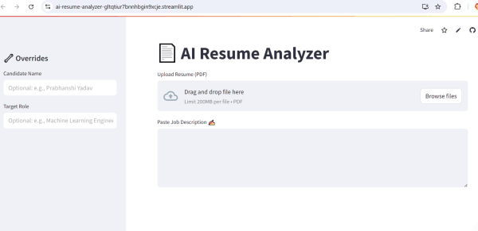

# 🤖 AI Resume Analyzer

**AI-Powered Resume Matcher & Analyzer** that compares resumes against job descriptions using advanced NLP and Machine Learning to score compatibility, extract key skills, and visualize insights.
---

## 🔍 Features

- ✅ **Resume Text Extraction** from PDF
- 🧠 **BERT-based Semantic Similarity** between resume and job description
- 🧩 **Skill Keyword Matching** with customizable keyword list
- 🧾 **Auto-detect Name & Email** from resume text
- 📊 **Visual Analysis**: Bar charts and progress bars
- 📥 **Downloadable Match Report**
- 🌐 **Deployable via Streamlit Cloud**


---

## 📽️ Demo

 
📁 **GitHub Repo**: [github.com/Prabhanshiyadav/AI-resume-analyzer](https://github.com/Prabhanshiyadav/AI-resume-analyzer)

---

## 🛠️ Tech Stack

- Python 3.9+
- Streamlit
- SpaCy
- Transformers (BERT)
- Scikit-learn
- Matplotlib
- PyPDF2

---

## 🧪 How It Works

1. **Upload Resume** (PDF)
2. **Paste Job Description**
3. **App Extracts**:
   - Resume text
   - Candidate name and email
   - Matches skills with keywords
   - Calculates BERT-based similarity
4. **Visualizes**:
   - Skills match percentage
   - JD coverage score
   - Missing skills
5. **Generates** downloadable report

---

## 🖥️ Run Locally

```bash
git clone https://github.com/Prabhanshiyadav/AI-resume-analyzer.git
cd AI-resume-analyzer
pip install -r requirements.txt
streamlit run ai-resume-analyzer/app.py
